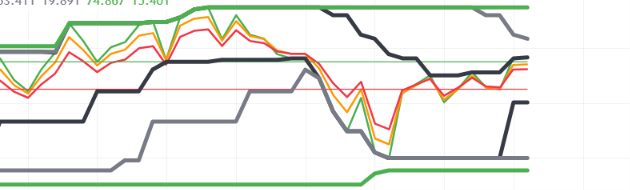

# Pine-Script-Triple-RSI-Price-Channel-Indicator
Oscillator indicator combining a 3-line multi-period RSI ribbon (lengths 7, 9, 12) with multi-tiered Donchian Price Channels computed directly on the fast RSI line. Features directional momentum thresholds (55 / 45) and modular "Use" toggles for dynamic oscillator boundary analysis on TradingView.
--
## Chart Preview

--
## Motivation & Problem
- **Static Oscillator Limits in Trending Markets**: Standard RSI indicators rely on rigid overbought (70) and oversold (30) levels that frequently fail during sustained trends, where momentum remains pinned at extremes while price continues to trend strongly.
- **The Core Goal**: To engineer a dynamic, volatility-adaptive momentum oscillator by wrapping a fast 7-period RSI within three nested Donchian Price Channels (lengths 9, 20, 52)—allowing traders to spot oscillator range breakouts, momentum squeezes, and relative cycle exhaustion within the sub-pane.
--
## Strategy Logic & Architecture
- This indicator measures internal oscillator volatility and momentum expansion by utilizing a **rule-based, multi-factor filtering system**:
### Core Components:
1. **Triple-Length RSI Ribbon & Threshold Levels**:
  - Plots three concurrent RSI lines: fast RSI 7 (green), intermediate RSI 9 (orange), and smooth RSI 12 (red).
  - Features fixed horizontal threshold benchmarks at 55 (bullish expansion baseline, green) and 45 (bearish expansion baseline, red).
  - Evaluates momentum direction based on ribbon cascading and alignment relative to the 55/45 thresholds.
2. **RSI-Mapped Price Channels (Donchian on RSI)**:
  - Applies Donchian highest/lowest logic directly onto the fastest RSI line ('RSI1') across three distinct cycle periods:
    - **PC 1 (Short-Term - Period 9)**: Computes the 9-period highest and lowest RSI extremes ('ta.highest(RSI1, 9)' / 'ta.lowest(RSI1, 9)'), detecting immediate momentum range bounds.
    - **PC 2 (Intermediate-Term - Period 20)**: Computes 20-period RSI extremes, marking intermediate momentum support and resistance bands.
    - **PC 3 (Long-Term - Period 52)**: Computes 52-period RSI extremes, establishing macro momentum boundaries.
3. **Modular Channel Switches ("Use" Toggles)**:
  - Introduces independent boolean toggles ('UsePC1', 'UsePC2', 'UsePC3') utilizing ternary plot masking ('UsePC ? highprice : na') to allow traders to selectively show or hide individual channel tiers without code modification.
--
## Configurable Parameters
Users can adjust the following parameters inside TradingView's settings panel:
- **RSI Lengths**: Default - 7 (fast), 9 (intermediate), 12 (slow). Lookback periods for the triple-RSI ribbon.
- **PC Switches**: Default - 'UsePC1' (true), 'UsePC2' (true), 'UsePC3' (true). Individual visibility toggles for each price channel envelope.
- **PC 1 Settings (Short-Term)**: Default - Length 9, Offset 0, Color Black, Linewidth 4. Lookback period and style for the fast RSI price channel.
- **PC 2 Settings (Intermediate-Term)**: Default - Length 20, Offset 0, Color Gray, Linewidth 4. Lookback period and style for the intermediate RSI price channel.
- **PC 3 Settings (Long-Term)**: Default - Length 52, Offset 0, Color Green, Linewidth 4. Lookback period and style for the macro RSI price channel.
--
## How to Install & Use in TradingView
1. Open any chart (e.g., `BTC/USDT`) on **[TradingView](https://www.tradingview.com/)**.
2. Open the **`Pine Editor`** console at the bottom of the page.
3. Open `Triple-RSI-PC.txt` (or your Pine Script file), copy the source code, and paste it into the editor.
4. Click **`Save`** and then click **`Add to Chart`**.
5. The indicator will load into a dedicated oscillator pane below the main price chart. Click the gear icon (`Settings`) to customize RSI lengths and channel toggles as needed.
--
## Key Learnings & Engineering Reflections
1. **Mapping Donchian Channels onto Oscillator Data ('ta.highest(RSI, length)')**
  - I learned that calculating highest and lowest bands on an oscillator series rather than price bars generates self-adjusting, dynamic overbought/oversold boundaries that adapt automatically to changing market volatility regimes.
2. **Multi-Tiered Momentum Squeezes & Breakouts**
  - I learned that when the 9-period and 52-period RSI price channels contract into a narrow corridor, it signals momentum compression. An RSI breakout piercing through the outer 52-period channel band signals an aggressive momentum expansion phase.
3. **Sub-Pane Visual Cleanliness via Ternary Masking ('UsePC ? line : na')**
  - I learned that implementing ternary conditional rendering in plot calls keeps complex multi-band oscillator panes clean and modular, letting traders isolate only the specific channel resolutions relevant to their trading style.
